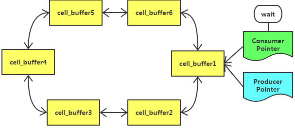
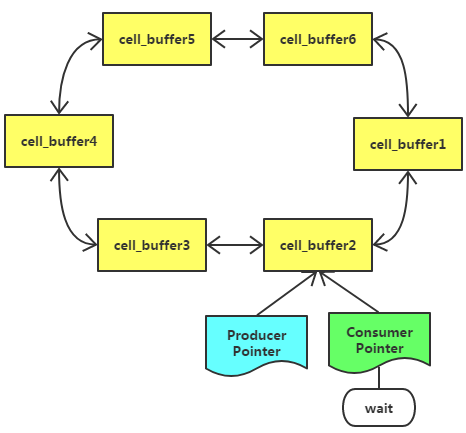
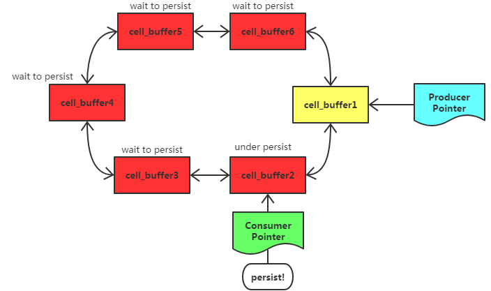

# MuLog logging library

## 正文

### 简介
MuLog是一个适用于C++的异步日志， 其特点是效率高、易拓展，尤其适用于频繁写日志的场景

**一句话介绍原理**：
使用多个大数组缓冲区作为日志缓冲区，多个大数组缓冲区以双循环链表方式连接，并使用两个指针`p1`和`p2`指向链表两个节点，分别用以生成数据、与消费数据 

生产者可以是多线程，共同持有p1来生产数据，消费者是一个后台线程，持有p2去消费数据

**大数组缓冲区 + 双循环链表的设计，使得日志缓冲区相比于队列有更强大的拓展能力、且避免了大量内存申请释放，提高了异步日志在海量日志生成下的性能表现**

### 具体工作原理

#### 数据结构

MuLog的缓冲区是若干个`cell_buffer`以双向、循环的链表组成 
`cell_buffer`是简单的一段缓冲区，日志追加于此，带状态：

* `FREE`：表示还有空间可追加日志

* `FULL`：表示暂时无法追加日志，正在、或即将被持久化到磁盘；

MuLog有两个指针：

* `Producer Ptr`：生产者产生的日志向这个指针指向的`cell_buffer`里追加，写满后指针向前移动，指向下一个`cell_buffer`；`Producer Ptr`永远表示当前日志写入哪个`cell_buffer`，被多个生产者线程共同持有

* `Consumer Ptr`：消费者把这个指针指向的`cell_buffer`里的日志持久化到磁盘，完成后执行向前移动，指向下一个`cell_buffer`；`Consumer Ptr`永远表示哪个`cell_buffer`正要被持久化，仅被一个后台消费者线程持有

起始时刻，每个`cell_buffer`状态均为`FREE` 
`Producer Ptr`与`Consumer Ptr`指向同一个`cell_buffer`

整个MuLog被一个互斥锁`mutex`保护

#### 大致原理

##### 消费者

后台线程（消费者）forever loop：

1. 上锁，检查当前`Consumer Ptr`
   	1. 如果对应`cell_buffer`状态为`FULL`，释放锁，去STEP 4；
    	2. 否则，以1秒超时时间等待条件变量`cond`；
2. 再次检查当前`Consumer Ptr`
   1. 若`cell_buffer`状态为`FULL`，释放锁，去STEP 4；
   2. 否则，如果`cell_buffer`无内容，则释放锁，回到STEP 1；
   3. 如果`cell_buffer`有内容，将其标记为`FULL`，同时`Producer Ptr`前进一位；
3. 释放锁
4. 持久化`cell_buffer`
5. 重新上锁，将`cell_buffer`状态标记为`FREE`，并清空其内容；`Consumer Ptr`前进一位；
6. 释放锁

**生产者**

1. 上锁，检查当前`Producer Ptr`对应`cell_buffer`状态：
   如果`cell_buffer`状态为`FREE`，且生剩余空间足以写入本次日志，则追加日志到`cell_buffer`，去*STEP X*；
2. 如果`cell_buffer`状态为`FREE`但是剩余空间不足了，标记其状态为`FULL`，然后进一步探测下一位的`next_cell_buffer`：
   1. 如果`next_cell_buffer`状态为`FREE`，`Producer Ptr`前进一位，去*STEP X*；
   2. 如果`next_cell_buffer`状态为`FULL`，说明`Consumer Ptr` = `next_cell_buffer`，MuLog缓冲区使用完了；则我们继续申请一个`new_cell_buffer`，将其插入到`cell_buffer`与`next_cell_buffer`之间，并使得`Producer Ptr`指向此`new_cell_buffer`，去*STEP X*；

3. 如果`cell_buffer`状态为`FULL`，说明此时`Consumer Ptr` = `cell_buffer`，丢弃日志；
4. 释放锁，如果本线程将`cell_buffer`状态改为`FULL`则通知条件变量`cond`

> 在大量日志产生的场景下，MuLog有一定的内存拓展能力；实际使用中，为防止MuLog缓冲区无限拓展，会限制内存总大小，当超过此内存限制时不再申请新`cell_buffer`而是丢弃日志

#### 图解各场景

初始时候，`Consumer Ptr`与`Producer Ptr`均指向同一个空闲`cell_buffer1`

然后生产者在1s内写满了`cell_buffer1`，`Producer Ptr`前进，通知后台消费者线程持久化

消费者持久化完成，重置`cell_buffer1`，`Consumer Ptr`前进一位，发现指向的`cell_buffer2`未满，等待

超过一秒后`cell_buffer2`虽有日志，但依然未满：消费者将此`cell_buffer2`标记为`FULL`强行持久化，并将`Producer Ptr`前进一位到`cell_buffer3`

消费者在`cell_buffer2`的持久化上延迟过大，结果生产者都写满`cell_buffer3\4\5\6`，已经正在写`cell_buffer1`了

生产者写满写`cell_buffer1`，发现下一位`cell_buffer2`是`FULL`，则拓展换冲区，新增`new_cell_buffer`

### 扩展功能

内存池，扩容之后别忘了缩容

### 性能测试

#### 1. 单线程连续写1亿条日志的效率

写1亿条日志（每条日志长度为100字节）测试调用总耗时，测5次，结果如下：

| 方式  |  第1次  |  第2次  |  第3次  |  第4次  |  第5次  |  平均  |   速度/s   |
| :---: | :-----: | :-----: | :-----: | :-----: | :-----: | :----: | :--------: |
| MuLog | 79.816s | 78.694s | 79.489s | 79.731s | 79.220s | 79.39s | 125.96万/s |

**每秒127万条**长为*100字节*的日志的写入

#### 2、多线程各写1千万条日志的效率

开5个线程各写1千万条日志（每条日志长度为100字节）测试调用总耗时，测5次，结果如下：

| 方式  |  第1次  |  第2次  |  第3次  |  第4次  |  第5次  |  平均   |   速度/s   |
| ----- | :-----: | :-----: | :-----: | :-----: | :-----: | :-----: | :--------: |
| MuLog | 36.896s | 37.011s | 38.524s | 37.197s | 38.034s | 37.532s | 133.22万/s |

多线程（5线程）运行下，`MuLog`写日志效率是传统同步日志的近`3.8`倍，可以达到**每秒135.5万条**长为*100字节*的日志的写入

#### 2. 对server QPS的影响

现有一个Reactor模式实现的echo Server（基于Muluo），其纯净的QPS大致为`19.32万/s`
现在分别使用`MuLog`来测试：echo Server在每收到一个数据就调用一次日志打印下的QPS表现

采集12次实时QPS，统计后大致结果如下：

|   方式   | 最低QPS  | 最高QPS  | 平均QPS  | QPS损失比 |
| :------: | :------: | :------: | :------: | :-------: |
| ` MuLog` | 154979次 | 178697次 | 167198次 |  13.46%   |

>传统同步日志损失了`40%`左右
>`MuLog`使得echo Server QPS从19.32w万/s降低至`16.72万/s`，损失了`13.46%`

