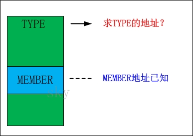

### 1. 说说你的日志系统动态缓冲区+双循环链表的设计

**一句话介绍原理**：
使用多个大数组缓冲区作为日志缓冲区，多个大数组缓冲区`cell_buffer`以**双向循环链表**方式连接，并使用两个指针`Producer Ptr`和`Consumer Ptr`指向链表两个节点，分别用以生成数据、与消费数据 

生产者可以是多线程，共同持有`Producer Ptr`来生产数据，消费者是一个后台线程，持有`Consumer Ptr`去消费数据

**大数组缓冲区 + 双循环链表的设计，使得日志缓冲区相比于队列有更强大的拓展能力、且避免了大量内存申请释放，提高了异步日志在海量日志生成下的性能表现**。

### 2. 为什么采用侵入式双向循环链表设计

Linux双向链表的定义主要涉及到两个文件：
`include/linux/types.h`
`include/linux/list.h`

**Linux中双向链表的使用思想**
它是将双向链表节点嵌套在其它的结构体中；在遍历链表的时候，根据双链表节点的指针获取"它所在结构体的指针"，从而再获取数据。

首先让我们看一下主结构体

```c
struct list_head {
    struct list_head *next, *prev;
};
```

通常来说一个链表会包含一个指向某个数据的指针。但是内核的实现并没有这样做。 所以问题来了：链表在哪里保存数据呢？


实际上内核里实现的链表实际上是**侵入式**链表。侵入式链表并不在节点内保存数据-**节点仅仅包含指向前后节点的指针**，然后把数据是附加到链表的。这就使得这个数据结构是通用的，使用起来就**不需要考虑节点数据的类型**了。


我举个例子来说明，可能比较容易理解。假设存在一个社区中有很多人，每个人都有姓名和年龄。通过双向链表将人进行关联的模型图如下：
[](https://images0.cnblogs.com/blog/497634/201402/231723247325249.jpg)

person代表人，它有name和age属性。为了通过双向链表对person进行链接，我们在person中添加了list_head属性。通过list_head，我们就将person关联起来了。

```c
struct person 
{ 
    int age; 
    char name[20];
    struct list_head list; 
};
```


看一下具体的实现：

在linux中，以"__"开头的函数意味着是内核的内部接口，外部不应该调用该接口。

**添加节点**

```c
//__list_add(new, prev, next)的作用是添加节点：将new插入到prev和next之间。
static inline void __list_add(struct list_head *new,
                  struct list_head *prev,
                  struct list_head *next)
{
    next->prev = new;
    new->next = next;
    new->prev = prev;
    prev->next = new;
}
//list_add(new, head)的作用是添加new节点：将new添加到head之后，是new称为head的后继节点。
static inline void list_add(struct list_head *new, struct list_head *head)
{
    __list_add(new, head, head->next);
}
//list_add_tail(new, head)的作用是添加new节点：将new添加到head之前，即将new添加到双链表的末尾。
static inline void list_add_tail(struct list_head *new, struct list_head *head)
{
    __list_add(new, head->prev, head);
}
```

**删除节点**

`\__list_del(prev, next)` 和`__list_del_entry(entry)`都是linux内核的内部接口。

`list_del(entry) `和 `list_del_init(entry)`是linux内核的对外接口。

```c
//__list_del(prev, next) 的作用是从双链表中删除prev和next之间的节点。
static inline void __list_del(struct list_head * prev, struct list_head * next)
{
    next->prev = prev;
    prev->next = next;
}

//list_del(entry) 的作用是从双链表中删除entry节点。
static inline void list_del(struct list_head *entry)
{
    __list_del(entry->prev, entry->next);
}
//__list_del_entry(entry) 的作用是从双链表中删除entry节点。
static inline void __list_del_entry(struct list_head *entry)
{
    __list_del(entry->prev, entry->next);
}
//list_del_init(entry) 的作用是从双链表中删除entry节点，并将entry节点的前继节点和后继节点都指向entry本身。
static inline void list_del_init(struct list_head *entry)
{
    __list_del_entry(entry);
    INIT_LIST_HEAD(entry);
}
```

**替换节点**

```c
//list_replace(old, new)的作用是用new节点替换old节点。
static inline void list_replace(struct list_head *old,
                struct list_head *new)
{
    new->next = old->next;
    new->next->prev = new;
    new->prev = old->prev;
    new->prev->next = new;
}
```


**判断双链表是否为空**

```c
//list_empty(head)的作用是判断双链表是否为空。它是通过区分"表头的后继节点"是不是"表头本身"来进行判断的。
static inline int list_empty(const struct list_head *head)
{
    return head->next == head;
}
```

**获取节点**

```c
#define list_entry(ptr, type, member) \
    container_of(ptr, type, member)
```

`list_entry(ptr, type, member) `实际上是调用的`container_of`宏。
它的作用是：根据"结构体(type)变量"中的"域成员变量(member)的指针(ptr)"来获取指向整个结构体变量的指针。

**container_of图解**
[](https://images0.cnblogs.com/blog/497634/201402/231706012867601.jpg)

type是结构体，它代表"整体"；而member是成员，它是整体中的某一部分，而且member的地址是已知的。
看作一个数学问题来看待，问题就相当简单了：**已知'整体'和该整体中'某一个部分'，要根据该部分的地址，计算出整体的地址。**


**遍历节点**

```c
#define list_for_each(pos, head) \
    for (pos = (head)->next; pos != (head); pos = pos->next)

#define list_for_each_safe(pos, n, head) \
    for (pos = (head)->next, n = pos->next; pos != (head); \
        pos = n, n = pos->next)
```

`list_for_each(pos, head)`和`list_for_each_safe(pos, n, head)`的作用都是遍历链表。但是它们的用途不一样！
`list_for_each(pos, head)`通常用于获取节点，而不能用到删除节点的场景。
`list_for_each_safe(pos, n, head)`通常删除节点的场景。


使用实例

```c
#include <stdio.h>
#include <stdlib.h>
#include <string.h>
#include "list.h"

struct person
{
    int age;
    char name[20];
    struct list_head list;
};

void main(int argc, char* argv[])
{
    struct person *pperson;
    struct person person_head;
    struct list_head *pos, *next;
    int i;

    // 初始化双链表的表头
    INIT_LIST_HEAD(&person_head.list);

    // 添加节点
    for (i=0; i<5; i++)
    {
        pperson = (struct person*)malloc(sizeof(struct person));
        pperson->age = (i+1)*10;
        sprintf(pperson->name, "%d", i+1);
        // 将节点链接到链表的末尾
        // 如果想把节点链接到链表的表头后面，则使用 list_add
        list_add_tail(&(pperson->list), &(person_head.list));
    }

    // 遍历链表
    printf("==== 1st iterator d-link ====\n");
    list_for_each(pos, &person_head.list)
    {
        pperson = list_entry(pos, struct person, list);
        printf("name:%-2s, age:%d\n", pperson->name, pperson->age);
    }

    // 删除节点age为20的节点
    printf("==== delete node(age:20) ====\n");
    list_for_each_safe(pos, next, &person_head.list)
    {
        pperson = list_entry(pos, struct person, list);
        if(pperson->age == 20)
        {
            list_del_init(pos);
            free(pperson);
        }
    }

    // 再次遍历链表
    printf("==== 2nd iterator d-link ====\n");
    list_for_each(pos, &person_head.list)
    {
        pperson = list_entry(pos, struct person, list);
        printf("name:%-2s, age:%d\n", pperson->name, pperson->age);
    }

    // 释放资源
    list_for_each_safe(pos, next, &person_head.list)
    {
        pperson = list_entry(pos, struct person, list);
        list_del_init(pos);
        free(pperson);
    }
}
```

**运行结果**：

```c
==== 1st iterator d-link ====
name:1 , age:10
name:2 , age:20
name:3 , age:30
name:4 , age:40
name:5 , age:50
==== delete node(age:20) ====
==== 2nd iterator d-link ====
name:1 , age:10
name:3 , age:30
name:4 , age:40
name:5 , age:50
```


我对侵入式链表的理解如下：
　　１.首先要实现侵入式链表最重要的就是实现一种**类型无关**的循环双向链表。
　　２.实现类型无关的循环双链表后，再尝试嵌入性工作，即将他嵌入到一般的结构体。然后进行观察，怎样才能使他们良好的工作，需要定义哪些接口用于初始化，以及使用等。粗略可以分为类型无关接口和类型有关接口
　　３.列举出循环双链表中常有的接口，并在该条件下良好的实现：
　　创建　添加(插入，拼接等)　删除　遍历(查找，显示等)　移动……


参考：https://www.cnblogs.com/skywang12345/p/3562146.html

